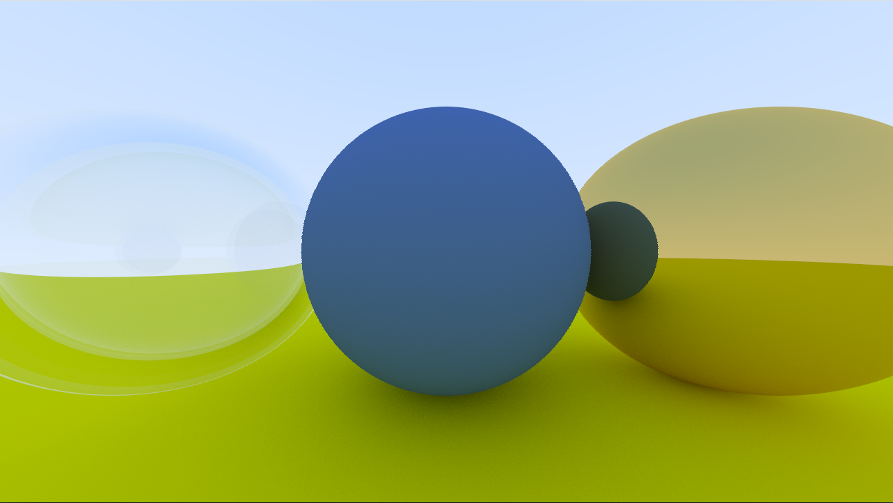
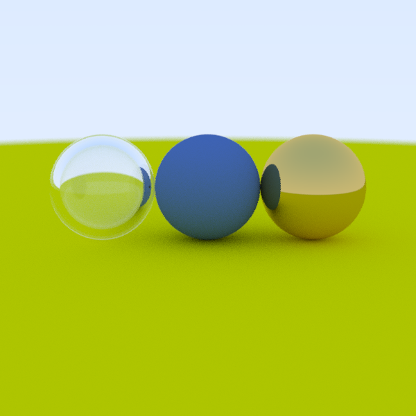
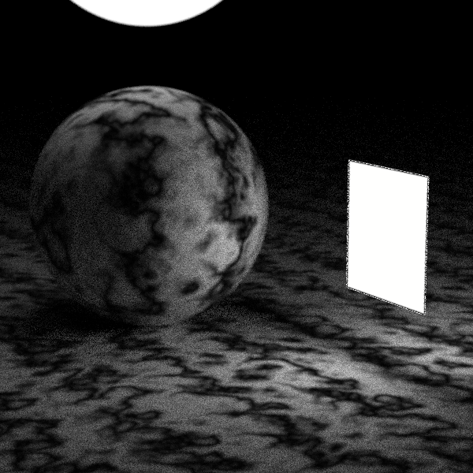
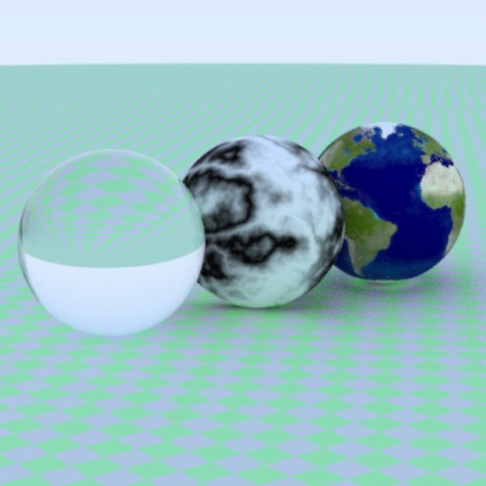
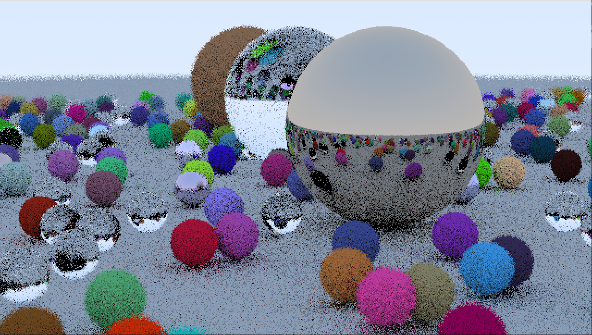
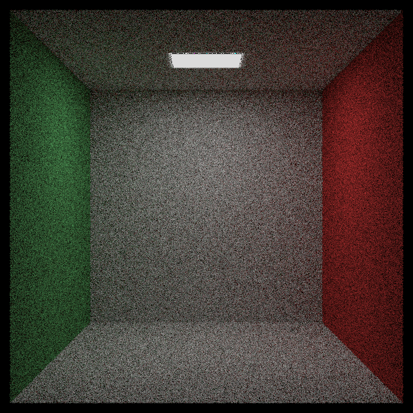
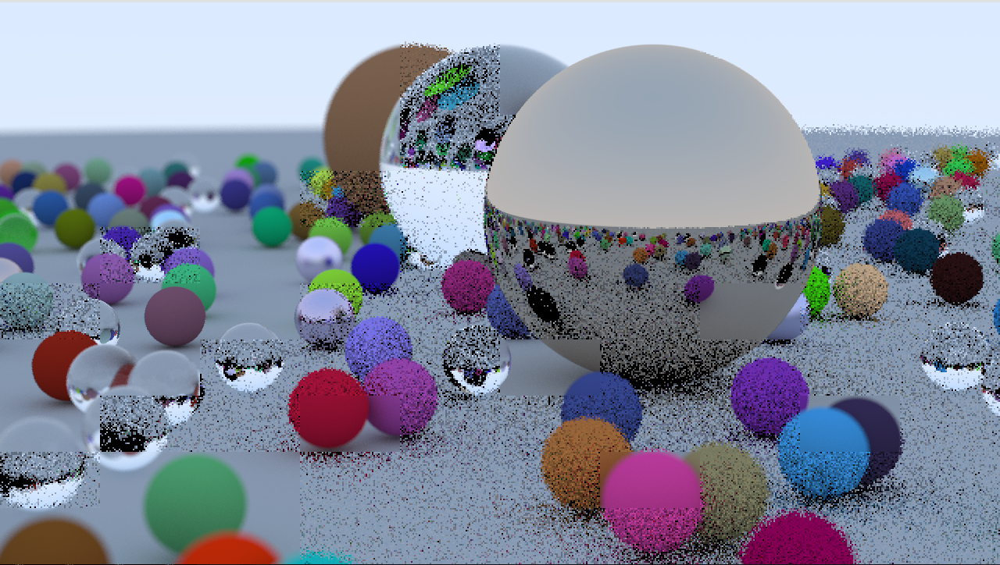
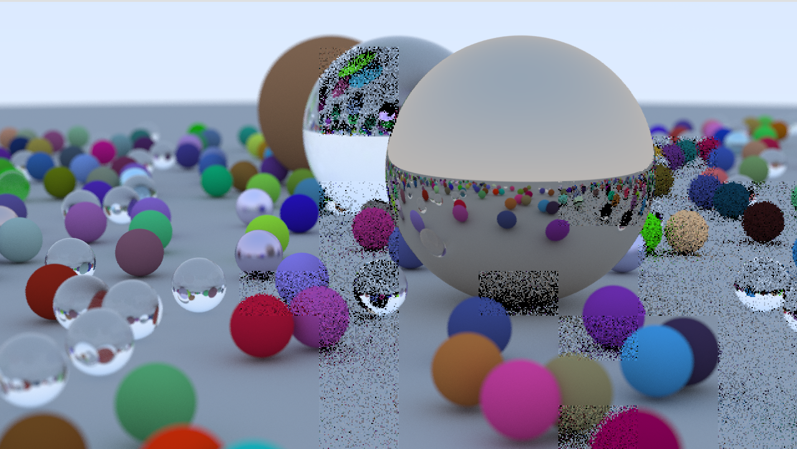

# Racer Tracer

A simple ray tracer written in rust. Feedback and contributions are
very welcome.

# Building

## Using nix
`nix develop`
After that you can do `cargo build`, `cargo run --release` etc.

## Not using nix
Currently needs rust version 1.65.0.

On Linux you may need to install these dependencies for the `minifb`
crate to work.

`sudo apt install libxkbcommon-dev`

## Examples

### Three balls
`cargo run --release -- --scene ../resources/scenes/three_balls.yml`

### Emissive
`cargo run --release -- --scene ../resources/scenes/emissive.yml`

### Noise and Textures
`cargo run --release -- --scene ../resources/scenes/noise_and_textures.yml`

### Clown
`cargo run --release -- --scene ../resources/scenes/clown.yml`

### Cornell Box
`cargo run --release -- --scene ../resources/scenes/cornell_box.yml`

# Running
The application accepts the following arguments.
`--config` path to the config file.
`--scene` path to the scene file (only supports yml).
`--image-action` (png, show).
    Png saves the resulting image to config `image_output_dir`.
    Show just stops the rendering once its done and waits
    for you to press `R` again to continue with the real-time render.

Just running it without any arguments will use the default config and
scene provided by this repository. Once the application starts it will
present a crude preview image of the scene.

## Configuration
Note that command line got presidence over configuration. I suggest
you check config.yml for some ways to configure it. There are more
options available and if you want to check all I suggest you check
config.rs.

## Controls
`WASD`             : Moves the camera in a currently crude way.
`L-Mouse`          : Rotate the camera as you move the mouse.
`R`                : Starts/Aborts rendering the image.
`Q`                : Selects the object your mouse hovers over.
`E`                : Removes selected object.
`R-Mouse`          : Move selected object.
`Arrow Up/Down`    : Move selected object towards/away from you.
`Arrow Left/Right` : Move selected object left/right.
`Numpad +/-`       : Change camera FOV,
`Numpad 8/2`       : Change camera aperture,
`Numpad 4/6`       : Change camera focus distance,

## Rendering Progress
As you start rendering the image it will replace preview image with a
more refined one with the settings from the render block in your
configuration file.

Once the image is done rendering it will go forward with the selected
image action.
