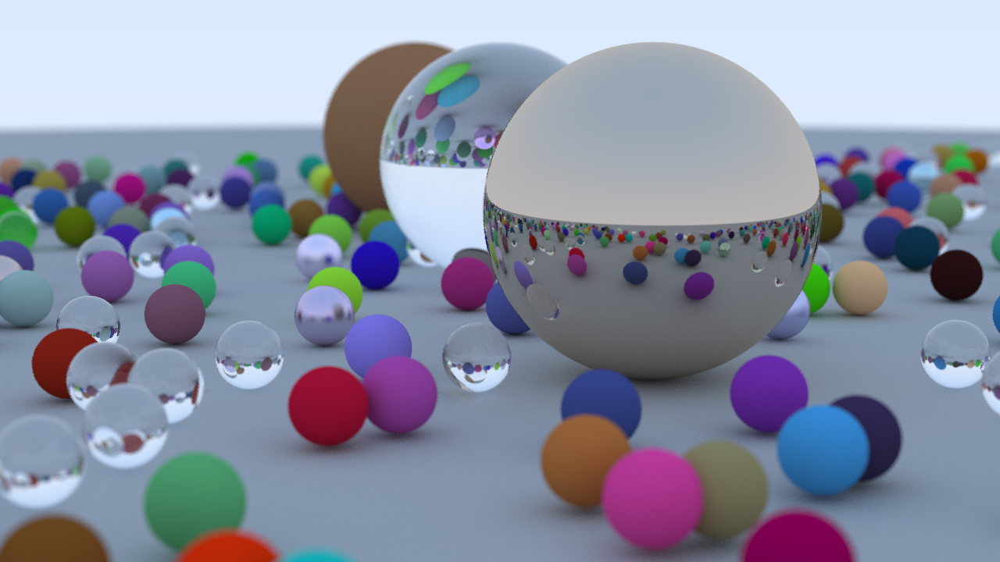

# Racer Tracer

A simple ray tracer written in rust. A hobby project for now. Feedback
and contributions are still very welcome.

# Building

## Using nix
`nix-shell default.nix`
After that you can do `cargo build`, `cargo run --release` etc.

## Not using nix
Currently uses rust version 1.65.0(may work on lower versions).

On Linux you may need to install these dependencies for the `minifb`
crate to work.

`sudo apt install libxkbcommon-dev libwayland-cursor0 libwayland-dev`

# Running
The application accepts the following arguments.
`--config` path to the config file.
`--scene` path to the scene file.

Just running it without any arguments will use the default config and
scene provided by this repository. Once the application starts it will
present a crude preview image of the scene.

## Controls
`WASD` Moves the camera in a currently crude way.
`R` Starts rendering the image.

